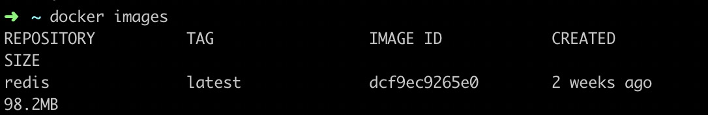
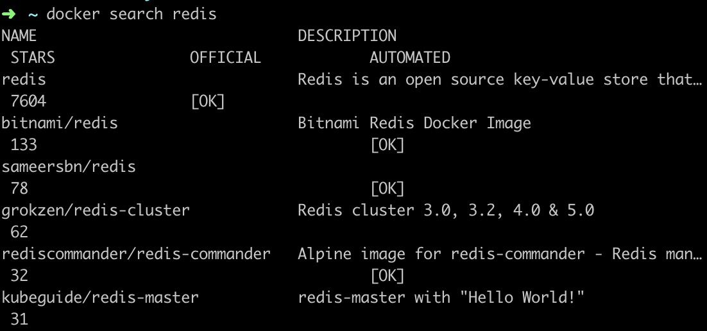

# Docker入门
## Docker是什么
Docker是一个开源的应用容器引擎，基于Go语言并遵从Apache2.0协议开源。Docker可以让开发者打包他们的应用以及依赖包到一个轻量级、可移植
的容器中。容器是完全沙箱机制，相互之间不会有任何接口，最重要的是容器性能开销很低。

## Docker基本概念
	Docker中三个非常重要的概念
	1. Image(镜像)：Docker镜像就相当于一个root文件系统。
	2. Container(容器): Image和Container的关系类似于面向对象程序设计中的类和实例一样，镜像是静态的定义，容器是镜像运行的实体。
	3. Respository(仓库)：用来保存镜像的仓库。

## Docker实践
### 镜像使用
当容器运行时，使用的镜像如果在本地不存在，docker就是自动从docker镜像仓库中下载，默认是从Docker Hub公共镜像源下载。

#### 1.列出镜像列表
docker images

    

 

选项说明:  
+ REPOSITORY:表示镜像的仓库源  
+ TAG：镜像的标签  
+ IMAGE ID：镜像ID  
+ SIZE：镜像大小

#### 2.查找镜像
docker search

	

  

+ NAME: 镜像仓库名称
+ DESCIPTION：镜像描述
+ OFFICIAL：是否docker官方发布
+ stars：类似Github中的star
+ AUTOMATED：自动构建

#### 3.获取一个新镜像
docker pull

#### 4.删除镜像
docker rmi 

### 容器使用
### 容器链接
### 仓库管理
### Dockerfile
### Compose
### Machine
### Swarm集群管理
## 附录
Docker官网：<https://www.docker.com>  
Github Docker源码：<https://github.com/docker/docker-ce>  
镜像加速：<http://hub-mirror.c.163.com>

